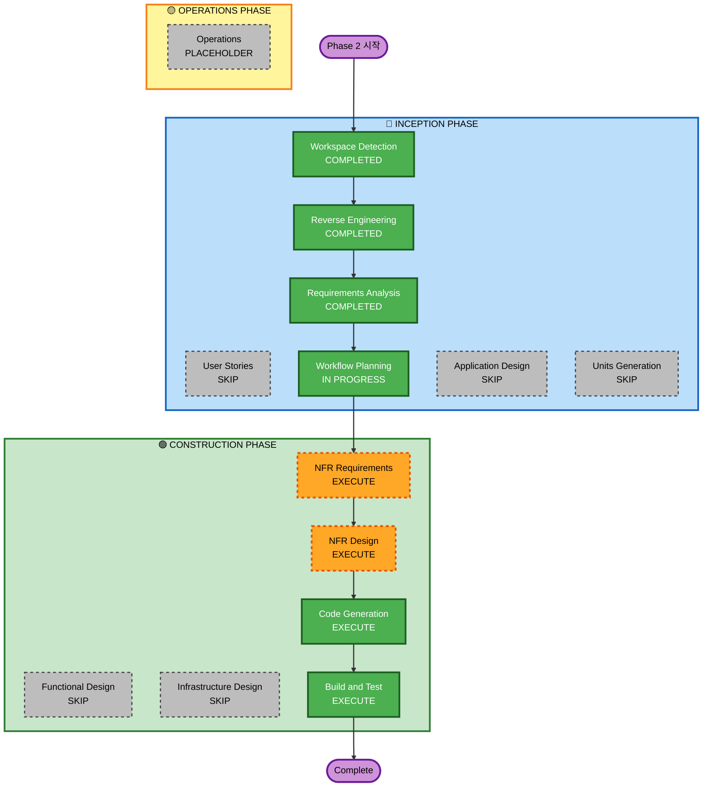

# Execution Plan — Phase 2: Monaco Editor + nGQL 구문 강조

## Detailed Analysis Summary

### Transformation Scope
- **Type**: Single-component enhancement + new language definition file
- **Primary Changes**: `QueryEditor.tsx` textarea → Monaco Editor; 새 `src/lib/ngql-language.ts`
- **Related Components**: `QueryEditor.tsx`, `QueryEditor.test.tsx`, `QueryEditor.css`, `package.json`

### Change Impact Assessment
- **User-facing changes**: Yes — 에디터 UI 개선 (구문 강조, Monaco 기능)
- **Structural changes**: No — 컴포넌트 인터페이스(`onExecute`, `isExecuting`, `isConnected`) 유지
- **Data model changes**: No
- **API changes**: No — Tauri 커맨드 변경 없음
- **NFR impact**: Yes — PBT 적용 대상(토크나이저) 추가

### Risk Assessment
- **Risk Level**: Low-Medium
- **Rollback Complexity**: Easy — 파일 단위 변경
- **Testing Complexity**: Moderate — Monaco는 jsdom에서 mock 필요

---

## Workflow Visualization

---

## Phases to Execute

### 🔵 INCEPTION
- [x] Workspace Detection — COMPLETED (재사용)
- [x] Reverse Engineering — COMPLETED (재사용)
- [x] Requirements Analysis — COMPLETED
- [ ] User Stories — **SKIP** (단일 컴포넌트 교체, 팀 협업 불필요)
- [x] Workflow Planning — IN PROGRESS
- [ ] Application Design — **SKIP** (새 컴포넌트 없음, 파일 추가만)
- [ ] Units Generation — **SKIP** (단일 작업 단위)

### 🟢 CONSTRUCTION
- [ ] Functional Design — **SKIP** (새 비즈니스 로직 없음)
- [ ] NFR Requirements — **EXECUTE** (PBT 적용 대상 식별 필요)
- [ ] NFR Design — **EXECUTE** (NFR Requirements 실행이므로)
- [ ] Infrastructure Design — **SKIP** (인프라 변경 없음)
- [ ] Code Generation — **EXECUTE**
- [ ] Build and Test — **EXECUTE**

---

## Success Criteria
- Monaco 에디터 렌더링 + 기존 단축키/히스토리 동작 유지
- nGQL 구문 강조 동작
- 전체 테스트 통과 (QueryEditor 포함)
- lint/format/build green
