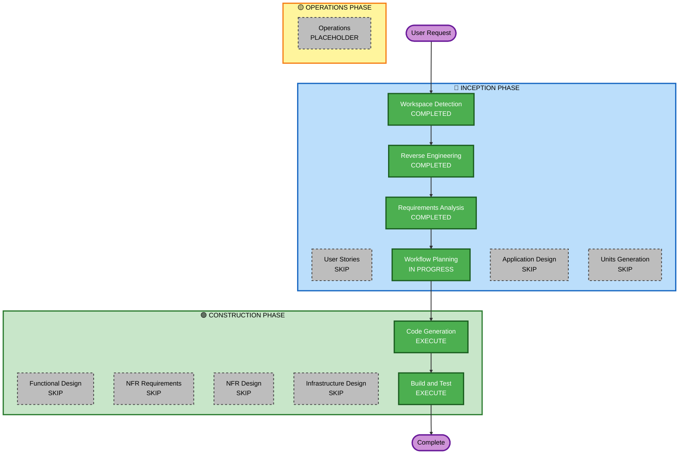

# Execution Plan

## Detailed Analysis Summary

### Transformation Scope
- **Transformation Type**: Single-unit refactoring (no architectural change)
- **Primary Changes**: 개발 도구 설정 추가 (ESLint, Prettier, rustfmt, clippy, CI) + TypeScript 타입 중앙화
- **Related Components**: 프론트엔드 전체 (`src/`), 백엔드 전체 (`src-tauri/src/`), 빌드 설정 (`package.json`, `Cargo.toml`), 새 파일 (`.github/workflows/ci.yml`, `src/types.ts`, `eslint.config.ts`, `.prettierrc`, `src-tauri/rustfmt.toml`)

### Change Impact Assessment
- **User-facing changes**: No — 런타임 동작 변경 없음
- **Structural changes**: No — 아키텍처 변경 없음
- **Data model changes**: Yes (minor) — TypeScript 타입을 `src/types.ts`로 이동 (기능 동일, 위치만 변경)
- **API changes**: No — Tauri 커맨드 시그니처 변경 없음
- **NFR impact**: Yes (positive) — 코드 품질 기준선 확립, CI로 회귀 방지

### Risk Assessment
- **Risk Level**: Low
- **Rollback Complexity**: Easy — 설정 파일 추가/삭제, import 경로 변경이 전부
- **Testing Complexity**: Simple — 기존 테스트 61개가 회귀 검증 역할을 함

---

## Workflow Visualization



### Text Alternative
```
INCEPTION:  WD(done) → RE(done) → RA(done) → WP(done) → [US skip] [AD skip] [UG skip]
CONSTRUCTION: [FD skip] [NFR-R skip] [NFR-D skip] [ID skip] → CG(execute) → BT(execute)
OPERATIONS: [placeholder]
```

---

## Phases to Execute

### 🔵 INCEPTION PHASE
- [x] Workspace Detection — COMPLETED
- [x] Reverse Engineering — COMPLETED
- [x] Requirements Analysis — COMPLETED
- [ ] User Stories — **SKIP**
  - **Rationale**: 순수 기술부채 리팩터링. 사용자 페르소나 없음, UX 영향 없음, 인수 기준은 requirements.md에 이미 명시됨.
- [x] Workflow Planning — IN PROGRESS (이 문서)
- [ ] Application Design — **SKIP**
  - **Rationale**: 새 컴포넌트/서비스 없음. 기존 컴포넌트 경계 내 변경(설정 파일 추가, import 경로 변경).
- [ ] Units Generation — **SKIP**
  - **Rationale**: 단일 작업 단위. 분해할 복잡도 없음.

### 🟢 CONSTRUCTION PHASE
- [ ] Functional Design — **SKIP**
  - **Rationale**: 새 비즈니스 로직 없음. 타입 이동은 구조적 변경이 아닌 파일 재배치.
- [ ] NFR Requirements — **SKIP**
  - **Rationale**: NFR은 requirements.md에 이미 정의됨 (기존 테스트 통과, 번들 크기 유지). 별도 NFR 설계 불필요.
- [ ] NFR Design — **SKIP**
  - **Rationale**: NFR Requirements 스킵이므로 연동 단계도 스킵.
- [ ] Infrastructure Design — **SKIP**
  - **Rationale**: 인프라 변경 없음. GitHub Actions CI는 코드 생성 단계에서 직접 작성.
- [ ] Code Generation — **EXECUTE** (ALWAYS)
  - **Rationale**: 6개 FR 구현 필요. Part 1(계획) → Part 2(생성) 순서로 진행.
- [ ] Build and Test — **EXECUTE** (ALWAYS)
  - **Rationale**: 빌드·테스트·린트 검증 지침 필요.

### 🟡 OPERATIONS PHASE
- [ ] Operations — PLACEHOLDER

---

## Code Generation 작업 범위 (미리보기)

Code Generation 단계에서 다룰 변경 목록:

| # | 변경 항목 | 파일 | 유형 |
|---|-----------|------|------|
| 1 | ESLint flat config | `eslint.config.ts` | 신규 |
| 2 | Prettier 설정 | `.prettierrc`, `.prettierignore` | 신규 |
| 3 | npm 스크립트 추가 | `package.json` | 수정 |
| 4 | ESLint/Prettier devDependencies | `package.json` | 수정 |
| 5 | rustfmt 설정 | `src-tauri/rustfmt.toml` | 신규 |
| 6 | clippy 설정 | `src-tauri/Cargo.toml` `[lints]` | 수정 |
| 7 | GitHub Actions CI | `.github/workflows/ci.yml` | 신규 |
| 8 | TypeScript 공통 타입 | `src/types.ts` | 신규 |
| 9 | 컴포넌트 import 경로 수정 | `src/App.tsx`, `src/components/*.tsx` | 수정 |

---

## Success Criteria

- **Primary Goal**: 코드 품질 기반 확립 — 린트/포매터/CI가 모두 green
- **Key Deliverables**: `eslint.config.ts`, `.prettierrc`, `src-tauri/rustfmt.toml`, `.github/workflows/ci.yml`, `src/types.ts`
- **Quality Gates**:
  - `npm run lint` — 오류 0개
  - `npm run format:check` — 통과
  - `npm run build` — 성공
  - `npm test` — 45개 통과
  - `cargo fmt --check` — 통과
  - `cargo clippy -- -D warnings` — 경고 0개
  - `cargo test` — 16개 통과
  - CI 워크플로우 — 모든 단계 green

## Estimated Timeline
- **Total Stages to Execute**: 2 (Code Generation + Build and Test)
- **Estimated Duration**: 1 세션 (단일 작업 단위, 복잡도 낮음)
