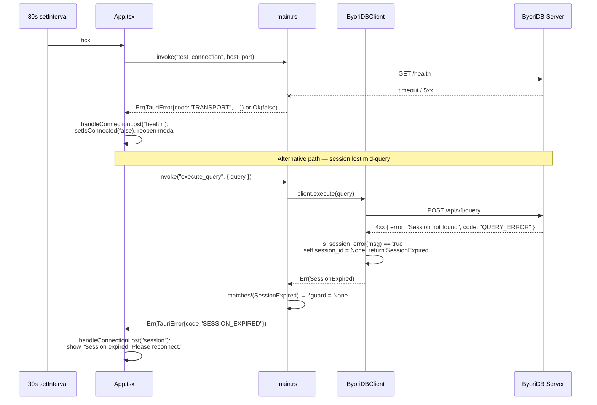

# System Architecture

## System Overview

ByoriDB Studio is a single-process **Tauri 2 desktop application** that pairs a React 19 + TypeScript frontend (rendered in the platform's WebView) with a Rust backend running in the same OS process. There is no application server: the Rust backend is invoked synchronously by the frontend via Tauri's IPC `invoke()` mechanism, and it speaks HTTP REST directly to an external ByoriDB graph database server.

The architecture is intentionally thin:
- The **frontend** is a pure UI + local-state layer (React hooks + `localStorage`). It never speaks HTTP itself; all network I/O is delegated to the backend.
- The **backend** is a stateful HTTP client (`ByoriDBClient`) plus a small command façade. It owns the single authenticated session.
- The **server** (`ByoriDB`, separate repo at `../byoridb`) is treated as a black box exposing the documented HTTP REST surface on port 19669.

This matches a "rich client" pattern: state of record lives on the server; the studio is a UI over it.

## Architecture Diagram

```mermaid
flowchart TB
    subgraph Desktop["💻 Operator Desktop (single Tauri process)"]
        subgraph WebView["🌐 WebView (React 19)"]
            App["App.tsx<br/>connection lifecycle,<br/>health-check polling"]
            CM["ConnectionModal"]
            SS["ServerSettings"]
            SB["Sidebar<br/>schema browser,<br/>describe cache"]
            QE["QueryEditor<br/>nGQL input + history"]
            RP["ResultPanel<br/>table / JSON / graph"]
            LS[("localStorage<br/>profiles, history")]
        end

        subgraph Rust["🦀 Rust process (Tauri commands)"]
            Cmds["main.rs<br/>connect / disconnect /<br/>execute_query / get_spaces /<br/>get_schema / test_connection"]
            State["AppState<br/>Arc&lt;Mutex&lt;Option&lt;ByoriDBClient&gt;&gt;&gt;"]
            Client["client.rs<br/>ByoriDBClient<br/>(reqwest, 5s connect / 30s total)"]
        end
    end

    Server["🗄️ ByoriDB Server<br/>(external, ../byoridb)<br/>HTTP :19669"]

    App -->|invoke()| Cmds
    SB -->|invoke()| Cmds
    QE -->|invoke()| Cmds
    SS -->|invoke()| Cmds
    CM -->|invoke()| Cmds
    SS <-->|read/write| LS
    QE <-->|read/write| LS

    Cmds --> State
    State --> Client
    Client -->|"POST /api/v1/session<br/>POST /api/v1/query<br/>DELETE /api/v1/session/{id}<br/>GET /health"| Server
    Server -->|"JSON body or<br/>{error, code}"| Client
```

### Text Alternative
- The Tauri process hosts both a WebView (React UI) and a Rust runtime side by side.
- Every UI action that needs network or persistent state crosses the IPC boundary via `invoke("command_name", { args })`.
- The Rust side holds exactly one optional `ByoriDBClient` behind an async `tokio::sync::Mutex`. Connect creates it; disconnect (or detected session loss) clears it.
- The `ByoriDBClient` is a thin HTTP wrapper around `reqwest` with explicit 5-second connect and 30-second overall timeouts. It handles authentication (`POST /api/v1/session`), query execution (`POST /api/v1/query`), and best-effort sign-out (`DELETE /api/v1/session/{id}`). `GET /health` is invoked by `test_connection` (called both by the settings UI and the 30-second health-poll loop).
- Local convenience state (saved server profiles under `byoridb-studio-connections`, query history under `byoridb-studio-query-history`) lives in `localStorage` only.

## Component Descriptions

### `App.tsx` (frontend, root component)
- **Purpose**: Entry point of the React tree; orchestrates the connection lifecycle and global UI state.
- **Responsibilities**:
  - Owns `isConnected`, `connectionConfig`, `currentSpace`, `queryResult`, `isExecuting`, `showConnectionModal`.
  - Calls `connect`, `disconnect`, `execute_query` Tauri commands.
  - Runs the 30-second `setInterval` health-check loop (calls `test_connection`).
  - Normalizes thrown values from `invoke()` into `{ code, message }` via `normalizeError`.
  - Dispatches connection-loss handling (session vs. health) through `handleConnectionLost`.
- **Dependencies**: `@tauri-apps/api/core` (for `invoke`), child components, `App.css`.
- **Type**: Application (UI orchestrator)

### `components/ConnectionModal.tsx`
- **Purpose**: First-run modal to collect connection parameters and trigger authentication.
- **Responsibilities**: Pre-fills from the first saved profile (if any), allows manual host/port/user/password edit, calls back to `App.handleConnect`.
- **Dependencies**: `ServerSettings` (re-uses `loadSavedConnections` and the `ConnectionConfig` / `SavedConnection` types).
- **Type**: Application (UI)

### `components/ServerSettings.tsx`
- **Purpose**: Sidebar tab that manages saved server profiles.
- **Responsibilities**: List, add, edit, delete, and connect to saved profiles in `localStorage`. Runs reachability tests via the `test_connection` command. Owns the storage key `byoridb-studio-connections` and exports `loadSavedConnections` / `saveSavedConnections` for reuse.
- **Dependencies**: `@tauri-apps/api/core` (`invoke`).
- **Type**: Application (UI)

### `components/Sidebar.tsx`
- **Purpose**: Schema browser plus the host for the Settings tab.
- **Responsibilities**:
  - Tabs: "Schema" / "Settings".
  - On connect: loads spaces (`get_spaces`).
  - On space change: loads tags + edges (`get_schema`); resets per-space `expandedItems` and `describeCache`.
  - On expand of a tag/edge: lazy-runs `DESCRIBE TAG|EDGE <name>` and caches the rows by `(kind, name)` keyed as `tag:<name>` / `edge:<name>`.
  - Click on a tag name → executes `MATCH (v:<tag>) RETURN v LIMIT 100`.
  - Click on an edge name → executes `MATCH (s)-[e:<edge>]->() RETURN e LIMIT 100` (start node has a variable per byoridb's MATCH constraint).
- **Dependencies**: `@tauri-apps/api/core`, `ServerSettings`.
- **Type**: Application (UI)

### `components/QueryEditor.tsx`
- **Purpose**: nGQL input area.
- **Responsibilities**: Textarea-based editor with line numbers, sample-query shortcuts (`SHOW SPACES`, `SHOW TAGS`, `SHOW EDGES`, `SHOW PARTS`, `SHOW HOSTS`), ⌘↵ to execute, ⌘↑/⌘↓ to walk history, persists last 50 distinct queries to `localStorage` under `byoridb-studio-query-history`.
- **Dependencies**: None beyond React.
- **Type**: Application (UI). **Planned upgrade**: Monaco Editor (Phase 2 in `ROADMAP.md`).

### `components/ResultPanel.tsx`
- **Purpose**: Renders the most recent query result.
- **Responsibilities**: Three view modes — Table (header + rows + row index), JSON (`JSON.stringify(rows, null, 2)`), Graph (placeholder). Uses server-reported `rowCount` when present, otherwise `rows.length`. Renders `error` field as a dedicated error pane.
- **Dependencies**: None beyond React.
- **Type**: Application (UI)

### `main.tsx`
- **Purpose**: React entry point; mounts `<App />` under React StrictMode at `#root`.
- **Type**: Application (bootstrap)

### `src-tauri/src/main.rs`
- **Purpose**: Tauri command façade and process bootstrap.
- **Responsibilities**:
  - Initializes `tracing-subscriber` with an `EnvFilter` defaulting to `byoridb_studio=debug`.
  - Builds the Tauri app, registers the shell plugin, and stores `AppState { client: Arc<Mutex<Option<ByoriDBClient>>> }`.
  - Exposes commands `connect`, `disconnect`, `execute_query`, `get_spaces`, `get_schema`, `test_connection`.
  - Maps `ClientError` and `anyhow::Error` to `TauriError { code, message }` so the frontend gets a stable wire format.
  - On `SESSION_EXPIRED` from `execute_query`/`get_spaces`/`get_schema`, transparently nulls the local client so subsequent calls fail fast as `NOT_CONNECTED` until reconnect.
- **Dependencies**: `tauri`, `tauri-plugin-shell`, `serde`/`serde_json`, `tokio`, `anyhow`, `tracing`, `tracing-subscriber`, sibling `client` module.
- **Type**: Application (Tauri command surface)

### `src-tauri/src/client.rs`
- **Purpose**: Reusable HTTP client for ByoriDB's REST API + pure parsing helpers.
- **Responsibilities**:
  - `ByoriDBClient` struct holds the connection config and the optional `session_id: i64`.
  - `connect`: `POST /api/v1/session` with username/password; parses `session_id` strictly as i64 and stores it.
  - `disconnect`: best-effort `DELETE /api/v1/session/{id}`; errors are swallowed.
  - `execute`: `POST /api/v1/query` with `{ session_id: i64, query }`; returns parsed `QueryResult`. Detects session-loss via message heuristic and surfaces `ClientError::SessionExpired`, also nulling the local `session_id`.
  - `get_spaces` / `get_schema`: thin wrappers that run `SHOW SPACES` / `SHOW TAGS` / `SHOW EDGES` and parse the rows.
  - Free `test_connection(host, port)`: `GET /health` with a 5-second total timeout.
  - `ClientError` enum with stable string codes (`TRANSPORT`, `AUTH_FAILED`, `SESSION_EXPIRED`, `QUERY_ERROR`, `NOT_CONNECTED`, `PROTOCOL_ERROR`).
  - Pure helpers `parse_session_id`, `parse_error_response`, `parse_query_response`, `parse_names`, `parse_spaces`, `is_session_error` are unit-tested.
- **Dependencies**: `reqwest`, `serde`/`serde_json`, `anyhow`, `tracing`, `tokio` (test only).
- **Type**: Application (HTTP client + business types)

## Data Flow

### Sequence — Connect, browse, query (BT-3 → BT-7 → BT-9)

```mermaid
sequenceDiagram
    actor U as Operator
    participant CM as ConnectionModal
    participant App as App.tsx
    participant Tauri as Tauri IPC
    participant Cmd as main.rs (commands)
    participant C as ByoriDBClient
    participant S as ByoriDB Server

    U->>CM: enter host/port/user/password
    CM->>App: handleConnect(config)
    App->>Tauri: invoke("connect", { config })
    Tauri->>Cmd: connect(config, state)
    Cmd->>C: ByoriDBClient::connect(config)
    C->>S: POST /api/v1/session {username, password}
    S-->>C: 200 { session_id: 42, time_zone }
    C-->>Cmd: Ok(client { session_id: Some(42) })
    Cmd-->>App: Ok(())
    App->>App: setIsConnected(true), close modal

    Note over App,S: Sidebar mounts; loads spaces

    App->>Tauri: invoke("get_spaces")
    Tauri->>Cmd: get_spaces(state)
    Cmd->>C: client.get_spaces()
    C->>S: POST /api/v1/query {session_id:42, "SHOW SPACES"}
    S-->>C: 200 { results, column_names, latency_ms, row_count }
    C-->>Cmd: Ok(Vec<SpaceInfo>)
    Cmd-->>App: list of spaces

    U->>App: click "demo" space
    App->>Tauri: invoke("execute_query", { query: "USE demo" })
    Tauri->>Cmd: execute_query(...)
    Cmd->>C: client.execute("USE demo")
    C->>S: POST /api/v1/query
    S-->>C: 200 (empty result)
    C-->>App: QueryResult
    App->>App: setCurrentSpace("demo")

    U->>U: types "MATCH (n:person) RETURN n LIMIT 10"
    U->>App: ⌘↵
    App->>Tauri: invoke("execute_query", { query })
    Tauri->>Cmd: execute_query(...)
    Cmd->>C: client.execute(query)
    C->>S: POST /api/v1/query
    S-->>C: 200 { results, latency_ms, row_count }
    C-->>App: QueryResult
    App->>App: setQueryResult(...)
```

### Sequence — Lost connection / expired session (BT-11, BT-12)



## Integration Points

### External APIs
- **ByoriDB HTTP REST API** (`http://<host>:<port>`, default port `19669`)
  - `POST /api/v1/session` — authenticate (username/password) → `{ session_id: i64, time_zone }`
  - `DELETE /api/v1/session/{id}` — sign out (best-effort)
  - `POST /api/v1/query` — execute nGQL with `{ session_id: i64, query }` → `{ column_names, results, latency_ms, row_count }`
  - `GET /health` — liveness probe; returns 2xx on healthy
  - Error envelope: `{ error: string, code: string }` for 4xx/5xx
  - Reference: `../byoridb/byoridb-graph/src/server.rs`, `../byoridb/byoridb-graph/src/auth.rs`

### Databases
- None embedded. The studio holds zero authoritative state.
- The connected ByoriDB server holds all graph data.

### Local Storage (browser WebView)
- `byoridb-studio-connections` — JSON array of `SavedConnection { name, config }`
- `byoridb-studio-query-history` — JSON array of strings (last 50 distinct queries)

### Third-party Services
- None.

## Infrastructure Components

### Packaging / Deployment Model
- **Single-binary desktop app** built by `tauri build`. Output is platform-specific (`.app` on macOS, `.msi` on Windows, `.deb`/`.rpm`/`.AppImage` on Linux).
- Frontend is built by Vite into `dist/`, then bundled into the Tauri binary as static assets (`frontendDist: ../dist` in `tauri.conf.json`).
- No CDK, Terraform, or CloudFormation. No CI/CD configuration in this repo.

### Networking
- **No inbound surface** — this app is a client only and exposes no listening sockets.
- **Outbound traffic**: HTTP to the user-configured ByoriDB host:port, plus the dev-time Vite server (`http://localhost:1420`) when running `npm run tauri dev`.
- **CSP**: `null` in `tauri.conf.json` (permissive); appropriate for a local-only client but worth tightening if the studio ever loads remote content.

### Window
- Single window: `1280×800` default, `900×600` minimum, resizable, decorated, opaque (`tauri.conf.json::app.windows[0]`).

### Build Pipeline (developer-only, not CI)
1. `npm run dev` → Vite serves `http://localhost:1420`.
2. `npm run tauri dev` → Tauri spawns the Rust process, points the WebView at the Vite dev server.
3. `npm run build` → `tsc && vite build` produces `dist/`.
4. `npm run tauri build` → Tauri bundles `dist/` and the compiled Rust binary into a platform installer.
