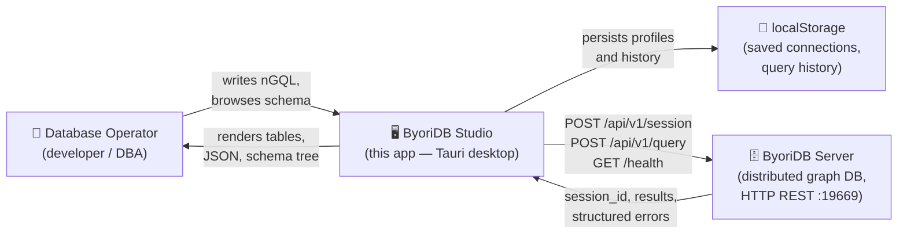

# Business Overview

## Business Context Diagram

### Text Alternative
The system has four actors:
1. **Database Operator** — the human user (typically a developer or DBA) who needs to query and inspect a ByoriDB graph database.
2. **ByoriDB Studio** — this Tauri desktop application; it is the only component owned by this repository.
3. **ByoriDB Server** — an external dependency (lives at `../byoridb`); a distributed graph database exposing HTTP REST on port 19669 and gRPC on 9669. This studio uses only the HTTP REST surface.
4. **localStorage** — browser/WebView storage on the operator's machine; persists saved server profiles and query history. No data is sent off-device beyond the configured ByoriDB server.

The studio mediates between the operator and the server: it manages a single authenticated session, executes nGQL queries, and renders results in tabular, JSON, or (planned) graph form.

## Business Description

### Business Description
ByoriDB Studio is a desktop GUI client that lets a database operator interactively manage and query a ByoriDB graph database from their workstation. It replaces ad-hoc CLI use with a visual workflow centered on three activities: connecting to a server, browsing schema, and running nGQL queries.

The studio is a **thin operator tool**, not a server or service. It owns no business data. All persistent state on the server side belongs to ByoriDB; the studio's only local persistence is operator-side convenience (saved connection profiles, recent query history) stored in browser `localStorage`.

### Business Transactions

The system implements the following operator-facing business transactions. Each maps to one or more Tauri commands and HTTP REST calls.

| # | Transaction | Description | Initiating UI | Backend command(s) | HTTP endpoint(s) |
|---|-------------|-------------|---------------|--------------------|------------------|
| BT-1 | **Save / edit / delete server profile** | Operator stores a named connection (host, port, username, password) for reuse. Profiles live in `localStorage` only. | `ServerSettings` tab (sidebar) | none (frontend only) | none |
| BT-2 | **Test server reachability** | Operator verifies a host:port is reachable before authenticating. Returns success/failure without creating a session. | `ServerSettings` "Test" button, `ConnectionModal` | `test_connection` | `GET /health` |
| BT-3 | **Connect (authenticate)** | Operator authenticates with username/password and receives a server-issued `session_id` (i64). Studio retains the session in memory. | `ConnectionModal` | `connect` | `POST /api/v1/session` |
| BT-4 | **Disconnect (sign out)** | Operator ends the session; studio drops the local `session_id` and best-effort signs out on the server. | "Disconnect" button in app header | `disconnect` | `DELETE /api/v1/session/{id}` |
| BT-5 | **Browse spaces** | Studio lists all spaces (graph databases) on the server in the sidebar. | Sidebar → Schema tab | `get_spaces` | `POST /api/v1/query` (`SHOW SPACES`) |
| BT-6 | **Select active space** | Operator clicks a space; studio runs `USE <space>` so subsequent queries scope to it. Failure does not change the active space; results panel is **not** overwritten. | Sidebar space row | `execute_query` (`USE …`) | `POST /api/v1/query` |
| BT-7 | **Browse schema (tags / edges)** | Studio lists all tags and edges in the active space. | Sidebar → Schema tab | `get_schema` | `POST /api/v1/query` (`SHOW TAGS`, `SHOW EDGES`) |
| BT-8 | **Describe a tag or edge** | Operator expands a tag/edge to see its property fields, types, nullability, and defaults. Lazy-loaded on first expand and cached per (space, kind, name). | Sidebar expand chevron | `execute_query` (`DESCRIBE TAG/EDGE …`) | `POST /api/v1/query` |
| BT-9 | **Execute ad-hoc nGQL query** | Operator writes nGQL in the editor and runs it; results render as table or JSON (graph view planned). | `QueryEditor` Execute button (or ⌘↵) | `execute_query` | `POST /api/v1/query` |
| BT-10 | **Recall query history** | Operator navigates the last 50 distinct queries with ⌘↑ / ⌘↓ in the editor. History persists in `localStorage`. | `QueryEditor` keyboard | none (frontend only) | none |
| BT-11 | **Detect lost connection** | Studio polls the server every 30 s; on failure it tears down the session in the UI and prompts the operator to reconnect. | Background `setInterval` in `App` | `test_connection` | `GET /health` |
| BT-12 | **Recover from expired session** | When the server reports `Session not found` / `Session expired`, studio surfaces a `SESSION_EXPIRED` code, drops local session state, and reopens the connection modal. | Implicit on any `execute_query` failure | `execute_query` (error path) | `POST /api/v1/query` |

### Business Dictionary

These terms appear throughout the codebase (UI labels, types, comments) and reflect ByoriDB / nGQL semantics:

| Term | Meaning in this system |
|------|------------------------|
| **Space** | A named, isolated graph database on the server. Analogous to a "database" in a relational system. Has `partition_num` and `replica_factor`. Operator must `USE <space>` before tag/edge queries. |
| **Tag** | A vertex type / label. Defines a named set of typed properties that vertices of that tag carry (e.g. `person(name STRING, age INT64)`). |
| **Edge** | A directed edge type connecting vertices. Has its own typed properties (e.g. `follows(since INT64)`). |
| **VID** | Vertex ID. Primary identifier for a vertex within a space; type is fixed per space (e.g. `INT64`). |
| **nGQL** | The query language used by ByoriDB. Supports DDL (`CREATE/DROP/ALTER/SHOW/DESCRIBE`), DML (`INSERT/UPDATE/DELETE`), and DQL (`MATCH/GO/FETCH/LOOKUP/FIND PATH`). |
| **Session** | A server-issued authenticated context, identified by an `i64` `session_id`. All queries require a valid session. |
| **Connection profile** | An operator-side, named tuple of `(host, port, username, password)` saved in `localStorage`. Not synchronized to the server. |
| **Query history** | Operator-side rolling list of the last 50 distinct queries the operator executed, in `localStorage`. |
| **Structured error** | `{ code, message }` shape returned to the frontend on any failed Tauri command. Stable codes include `TRANSPORT`, `AUTH_FAILED`, `SESSION_EXPIRED`, `QUERY_ERROR`, `NOT_CONNECTED`, `PROTOCOL_ERROR`. |

## Component Level Business Descriptions

### Frontend — `src/App.tsx`
- **Purpose**: Top-level UI orchestrator. Owns the connection lifecycle and the active space.
- **Responsibilities**:
  - Holds connection state (`isConnected`, `connectionConfig`, `currentSpace`).
  - Drives BT-3, BT-4, BT-6, BT-9, BT-11, BT-12.
  - Translates structured errors into user-visible messages and reopens the connection modal on session loss.

### Frontend — `src/components/ConnectionModal.tsx`
- **Purpose**: Modal UI for BT-3 (connect).
- **Responsibilities**: Pre-fills from the first saved profile, accepts host/port/username/password, delegates to `App.handleConnect`.

### Frontend — `src/components/ServerSettings.tsx`
- **Purpose**: Manages saved profiles (BT-1) and reachability test (BT-2).
- **Responsibilities**: CRUD on `localStorage` profiles, runs `test_connection` for the form values or saved entries, can hand a profile back to `App` to connect.

### Frontend — `src/components/Sidebar.tsx`
- **Purpose**: Schema browser (BT-5, BT-7, BT-8) plus profile management host.
- **Responsibilities**: Loads spaces on connect, loads tags/edges when a space is active, lazy-loads `DESCRIBE TAG|EDGE` per item with a per-space cache. Cache is invalidated on space switch and explicit refresh.

### Frontend — `src/components/QueryEditor.tsx`
- **Purpose**: nGQL editor with sample-query shortcuts and history (BT-9, BT-10).
- **Responsibilities**: Plain `<textarea>` (Monaco upgrade is roadmapped), ⌘↵ executes, ⌘↑/⌘↓ navigates history, last 50 distinct queries persisted in `localStorage`.

### Frontend — `src/components/ResultPanel.tsx`
- **Purpose**: Renders query results.
- **Responsibilities**: Switches between Table, JSON, and a placeholder Graph view. Uses server-reported `row_count` if present, else `rows.length`.

### Backend — `src-tauri/src/main.rs`
- **Purpose**: Tauri command surface — the bridge between frontend `invoke()` and the Rust client.
- **Responsibilities**: Holds the singleton client in `AppState` (`Arc<Mutex<Option<ByoriDBClient>>>`), maps `ClientError` to a stable `TauriError { code, message }`, transparently clears the local session on `SESSION_EXPIRED` so the UI and backend agree on connection state.

### Backend — `src-tauri/src/client.rs`
- **Purpose**: Pure HTTP client for ByoriDB plus parsing helpers.
- **Responsibilities**: Authenticates, executes queries, parses `column_names` / `results` / `latency_ms` / `row_count`, parses `SHOW SPACES` and `SHOW TAGS/EDGES` into typed structs, classifies errors into `ClientError` variants. Heuristic detection of session-loss messages keeps the UI in sync until the server adds a dedicated `code`. All HTTP calls have a 5 s connect / 30 s overall timeout.
