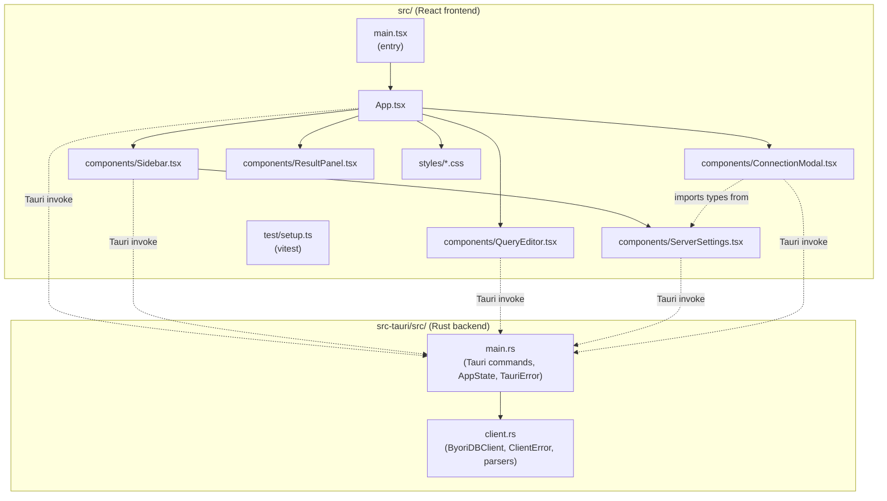

# Code Structure

## Build System

The repository uses **two build systems** glued by Tauri's CLI:

### Frontend (Node / npm + Vite)
- **Type**: npm (`package-lock.json` present), Vite 7 as bundler/dev server
- **Configuration**:
  - `package.json` — npm scripts (`dev`, `build`, `test`, `coverage`, `preview`, `tauri`)
  - `vite.config.ts` — React plugin, Vitest config (jsdom + global APIs + `src/test/setup.ts`), v8 coverage with `text` + `html` reporters, dev server pinned to `localhost:1420` with strict port and `src-tauri/**` watch ignore
  - `tsconfig.json` — strict TypeScript (`strict`, `noUnusedLocals`, `noUnusedParameters`, `noFallthroughCasesInSwitch`), `jsx: "react-jsx"`, ES2020 target, `bundler` module resolution, Vitest + jest-dom global types
  - `tsconfig.node.json` — separate project for `vite.config.ts`
  - `index.html` — Vite entry, mounts `<div id="root"></div>` and loads `src/main.tsx`

### Backend (Cargo + Tauri 2)
- **Type**: Cargo (Rust 2021 edition, MSRV 1.70)
- **Configuration**:
  - `src-tauri/Cargo.toml` — package manifest, Tauri 2 + plugins, async runtime (Tokio), HTTP client (reqwest)
  - `src-tauri/Cargo.lock` — committed
  - `src-tauri/tauri.conf.json` — product name, identifier (`com.byoridb.studio`), build hooks (`beforeDevCommand: "npm run dev"`, `beforeBuildCommand: "npm run build"`, `frontendDist: "../dist"`), single window config (1280×800 default, 900×600 minimum), CSP `null`
  - `src-tauri/build.rs` — minimal, defers to `tauri_build`
  - `src-tauri/gen/schemas/` — generated capability/schema files (committed)

### npm scripts
| Script | Purpose |
|--------|---------|
| `npm run dev` | Vite dev server only (port 1420). Used by `tauri dev` as the WebView source. |
| `npm run build` | `tsc && vite build` → emits `dist/`. |
| `npm test` | `vitest run` (single-shot, jsdom). |
| `npm run coverage` | `vitest run --coverage` (v8 provider). |
| `npm run preview` | Static serve `dist/` for inspection. |
| `npm run tauri` | Forwards all args to the Tauri CLI; `npm run tauri dev` and `npm run tauri build` are the supported workflows. |

### Cargo commands (run inside `src-tauri/`)
| Command | Purpose |
|---------|---------|
| `cargo build` | Compile the Rust binary. |
| `cargo check` | Fast type/borrow check without codegen. |
| `cargo test` | Run unit tests in `client.rs` (`#[cfg(test)] mod tests`). |

## Repository Layout

```
byoridb-studio/
├── README.md                       # Public-facing project description
├── CLAUDE.md                       # Working notes for AI coding sessions (commands, architecture, nGQL crib)
├── ROADMAP.md                      # Long-term phased roadmap
├── NEXT.md                         # Active punch-list of next tasks
├── package.json                    # npm manifest + scripts
├── package-lock.json               # npm lockfile (committed)
├── tsconfig.json                   # TS config for src/
├── tsconfig.node.json              # TS config for vite.config.ts
├── vite.config.ts                  # Vite + Vitest config
├── index.html                      # Vite entry
├── public/
│   └── byoridb-studio.svg          # App icon used by index.html
├── src/                            # React frontend (TypeScript)
│   ├── main.tsx                    # React entry; renders <App/> in StrictMode
│   ├── App.tsx                     # Root component — connection lifecycle, health-poll, query orchestration
│   ├── App.test.tsx                # End-to-end-ish UI tests (mocks @tauri-apps/api/core)
│   ├── vite-env.d.ts               # Vite client types
│   ├── components/                 # UI components (each has co-located tests)
│   │   ├── ConnectionModal.tsx
│   │   ├── ConnectionModal.test.tsx
│   │   ├── QueryEditor.tsx
│   │   ├── QueryEditor.test.tsx
│   │   ├── ResultPanel.tsx
│   │   ├── ResultPanel.test.tsx
│   │   ├── ServerSettings.tsx
│   │   ├── ServerSettings.test.ts             # pure-function tests for load/save helpers
│   │   ├── ServerSettings.component.test.tsx  # component-level UI tests
│   │   ├── Sidebar.tsx
│   │   └── Sidebar.test.tsx
│   ├── styles/                     # Plain CSS, one file per component (Catppuccin Mocha palette)
│   │   ├── App.css
│   │   ├── ConnectionModal.css
│   │   ├── QueryEditor.css
│   │   ├── ResultPanel.css
│   │   ├── ServerSettings.css
│   │   ├── Sidebar.css
│   │   └── index.css
│   └── test/
│       └── setup.ts                # Vitest setup — imports @testing-library/jest-dom and stubs window.localStorage
├── src-tauri/                      # Rust backend (Tauri 2)
│   ├── Cargo.toml
│   ├── Cargo.lock
│   ├── build.rs                    # tauri-build invocation
│   ├── tauri.conf.json
│   ├── icons/                      # App icons (PNGs)
│   ├── gen/schemas/                # Generated capability schemas
│   └── src/
│       ├── main.rs                 # Tauri commands + AppState
│       └── client.rs               # ByoriDB HTTP client + parsing helpers (with #[cfg(test)] tests)
└── aidlc-docs/                     # AI-DLC artifacts (this folder)
    ├── aidlc-state.md
    ├── audit.md
    └── inception/
        └── reverse-engineering/
            └── (this and sibling artifacts)
```

## Module Hierarchy (Mermaid)



## Existing Files Inventory

These are the source files that will be candidates for modification on future feature work. Test files and configuration files are listed for completeness.

### Frontend application code (`src/`)
| File | Purpose / responsibility |
|------|--------------------------|
| `src/main.tsx` | React entry; mounts `<App/>` under `<React.StrictMode>` at `#root`. |
| `src/App.tsx` | Root component. Owns connection state (`isConnected`, `connectionConfig`, `currentSpace`, `queryResult`, `isExecuting`). Drives connect/disconnect/execute, 30 s health-check polling, and connection-loss recovery. Defines `normalizeError` and `HEALTH_POLL_INTERVAL_MS` (`30_000`). |
| `src/components/ConnectionModal.tsx` | Initial connect modal; pre-fills first saved profile, accepts host/port/user/password. |
| `src/components/ServerSettings.tsx` | Saved-profile manager (CRUD + reachability test) and the helpers `loadSavedConnections` / `saveSavedConnections`; storage key `byoridb-studio-connections`. Exports the `ConnectionConfig` and `SavedConnection` types reused by `ConnectionModal` and `Sidebar`. |
| `src/components/Sidebar.tsx` | Schema browser. Tabs Schema/Settings; loads spaces on connect, loads tags/edges on space change, lazy-runs `DESCRIBE TAG/EDGE` per item with a per-space cache; click on a name runs a sample MATCH. |
| `src/components/QueryEditor.tsx` | nGQL editor (textarea + line numbers); sample-query buttons; ⌘↵ to execute; ⌘↑/⌘↓ to walk history; persists last 50 distinct queries to `localStorage` under `byoridb-studio-query-history`. Exports `HISTORY_STORAGE_KEY`-equivalent literal. |
| `src/components/ResultPanel.tsx` | Result viewer. Three view modes: Table / JSON / Graph (placeholder). Exposes `formatValue` helper. |
| `src/vite-env.d.ts` | Vite ambient types. |

### Frontend styling (`src/styles/`)
- `App.css`, `ConnectionModal.css`, `QueryEditor.css`, `ResultPanel.css`, `ServerSettings.css`, `Sidebar.css`, `index.css` — one CSS file per component plus a global `index.css`. Theme is Catppuccin Mocha (per `README.md`).

### Frontend tests (`src/`)
| File | What it covers |
|------|----------------|
| `src/App.test.tsx` | High-level UI flow: connect → execute query → disconnect; AUTH_FAILED hint; SESSION_EXPIRED handling; health-poll teardown using `vi.useFakeTimers`; silent space selection. |
| `src/components/ConnectionModal.test.tsx` | Modal interaction tests. |
| `src/components/QueryEditor.test.tsx` | Editor shortcuts and history. |
| `src/components/ResultPanel.test.tsx` | Table / JSON / Graph view rendering. |
| `src/components/ServerSettings.component.test.tsx` | Profile CRUD UI. |
| `src/components/ServerSettings.test.ts` | Pure-function tests for `loadSavedConnections` / `saveSavedConnections`. |
| `src/components/Sidebar.test.tsx` | Schema loading, DESCRIBE expand/cache, error inline display. |
| `src/test/setup.ts` | Imports `@testing-library/jest-dom/vitest` and installs an in-memory `window.localStorage`. |

### Backend application code (`src-tauri/src/`)
| File | Purpose / responsibility |
|------|--------------------------|
| `src-tauri/src/main.rs` | Process bootstrap, Tauri builder, `AppState { client: Arc<Mutex<Option<ByoriDBClient>>> }`, command implementations, `TauriError { code, message }`, `From<ClientError>` and `From<anyhow::Error>` impls. Initializes `tracing-subscriber` with `byoridb_studio=debug`. |
| `src-tauri/src/client.rs` | `ByoriDBClient`, `ClientError` enum (with stable string codes), config/result/space/schema types, free `test_connection` for `GET /health`, parsing helpers (`parse_session_id`, `parse_query_response`, `parse_names`, `parse_spaces`, `parse_error_response`, `is_session_error`), and a `#[cfg(test)] mod tests` block. |

### Backend tests (`src-tauri/src/client.rs::tests`)
- Unit tests covering response parsing, session-id parsing rules, error response shape, session-error heuristic, error code stability, and `NotConnected` / no-op disconnect behavior. Async tests use `#[tokio::test]`. (No integration tests against a live server.)

### Configuration
- `package.json`, `package-lock.json` — npm
- `vite.config.ts` — Vite + Vitest
- `tsconfig.json`, `tsconfig.node.json` — TypeScript
- `index.html` — Vite entry HTML
- `src-tauri/Cargo.toml`, `src-tauri/Cargo.lock` — Cargo
- `src-tauri/tauri.conf.json` — Tauri 2 app config
- `src-tauri/build.rs` — `tauri_build::build()`
- `src-tauri/gen/schemas/` — generated Tauri capability schemas (committed)
- `src-tauri/icons/` — committed app icons

### Documentation (developer-facing)
- `README.md`, `CLAUDE.md`, `ROADMAP.md`, `NEXT.md` (the latter two are roadmap and active task list — not part of AI-DLC artifacts).

## Design Patterns

### Command pattern over IPC
- **Location**: `src-tauri/src/main.rs` (every `#[tauri::command]` function), called from the frontend via `invoke("name", { args })`.
- **Purpose**: Decouple the UI from the HTTP/connection layer; let the Rust side own the singleton client and async lifecycle.
- **Implementation**: Each command takes a `State<'_, AppState>`, locks the `Mutex`, and operates on the optional `ByoriDBClient`. Errors are funneled through `TauriError`.

### Single-state singleton with interior mutability
- **Location**: `src-tauri/src/main.rs::AppState { client: Arc<Mutex<Option<ByoriDBClient>>> }`.
- **Purpose**: One authenticated session per process; let any command read or replace it under an async-aware lock.
- **Implementation**: `Arc` for sharing, `tokio::sync::Mutex` for `await`-safe locking, `Option<_>` so disconnect/expiry can null it out.

### Error code at the boundary
- **Location**: `src-tauri/src/client.rs::ClientError`, `src-tauri/src/main.rs::TauriError`, consumed by `src/App.tsx::normalizeError`.
- **Purpose**: Give the UI a stable, machine-readable signal (`SESSION_EXPIRED`, `AUTH_FAILED`, ...) instead of free-text matching.
- **Implementation**: Rust enum → `code()` returning `&'static str` → serialized into `TauriError { code: String, message: String }` → narrowed to a TS interface on receipt.

### Pure parsing helpers
- **Location**: `src-tauri/src/client.rs` — `parse_session_id`, `parse_query_response`, `parse_names`, `parse_spaces`, `parse_error_response`, `is_session_error`.
- **Purpose**: Make response handling unit-testable without an HTTP server.
- **Implementation**: Each helper takes a parsed JSON value (or string) and returns a typed Rust struct or pair; tests in the same file feed in `serde_json::json!` literals.

### Lazy-load + per-space cache
- **Location**: `src/components/Sidebar.tsx` (`describeCache`, `expandedItems`).
- **Purpose**: Avoid running `DESCRIBE TAG|EDGE` for items the user never expands; avoid re-running them if the user collapses and re-expands.
- **Implementation**: Cache keyed `tag:<name>` / `edge:<name>`; whole cache is reset when `currentSpace` changes (different spaces have different schemas) or when the user explicitly refreshes.

### Defensive error normalization on the JS side
- **Location**: `src/App.tsx::normalizeError`.
- **Purpose**: `invoke()` rejections are normally serialized `TauriError`, but a transport or marshaling failure can throw a bare string or `Error`; UI code must not crash on those.
- **Implementation**: Type-narrow on `'code' in err && 'message' in err`, otherwise wrap in `{ code: "UNKNOWN", message: String(err) }`.

### Best-effort sign-out
- **Location**: `src-tauri/src/client.rs::ByoriDBClient::disconnect`.
- **Purpose**: A network failure during sign-out shouldn't keep the user "connected" in the UI.
- **Implementation**: Send `DELETE /api/v1/session/{id}`, ignore the response, always return `Ok(())`.

### Background liveness probe (no work cancellation)
- **Location**: `src/App.tsx` `useEffect` that runs `setInterval(check, HEALTH_POLL_INTERVAL_MS)`.
- **Purpose**: Detect a dead server within 30 s without interrupting an in-flight query.
- **Implementation**: Polls `test_connection` independently of any query state; tears down the session on failure via `handleConnectionLost("health")`. Cleanup uses both `clearInterval` and a captured `cancelled` flag to avoid setState after unmount.

## Critical Dependencies

(Detailed versions live in `dependencies.md`. This section names the *roles*.)

### Frontend
- **react@^19.2.3 / react-dom@^19.2.3** — UI framework. `App.tsx` and all components use functional components + hooks (`useState`, `useEffect`, `useRef`).
- **@tauri-apps/api@^2.9.1** — Frontend-side Tauri bindings; only `invoke` is used (`@tauri-apps/api/core`).
- **vite@^7.3.1** + **@vitejs/plugin-react@^5.1.2** — Dev server and bundler.
- **typescript@^5.9.3** — `tsc` runs as part of `npm run build`.
- **vitest@^4.1.5** + **@vitest/coverage-v8@^4.1.5** + **jsdom@^29.1.1** + **@testing-library/{react, jest-dom, user-event}** — Frontend test stack.

### Backend
- **tauri@2 / tauri-build@2 / tauri-plugin-shell@2** — Desktop runtime + build glue.
- **reqwest@0.12** (with `json` feature) — HTTP client; the only network library.
- **tokio@1** (with `full` feature) — Async runtime; `tokio::sync::Mutex` for the `AppState` lock.
- **serde@1 + serde_json@1** — Wire format for both Tauri IPC and the ByoriDB REST API.
- **anyhow@1** — Error wrapping at the public boundary of free functions (`test_connection`).
- **tracing@0.1 + tracing-subscriber@0.3 (env-filter)** — Structured logging on the backend.
