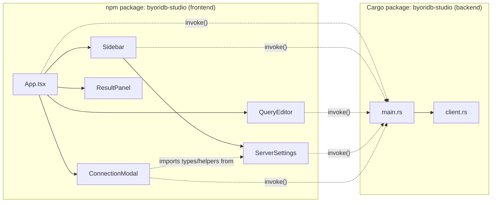

# Dependencies

This document lists internal module relationships and external (third-party) dependencies. Versions reflect the manifests (`package.json`, `src-tauri/Cargo.toml`); resolved versions live in the lockfiles (`package-lock.json`, `src-tauri/Cargo.lock`).

## Internal Dependencies

There are exactly two top-level packages — the npm frontend and the Cargo backend — and they are loosely coupled through Tauri's IPC boundary.

### Key intra-frontend dependency

- `ConnectionModal` and `Sidebar` import the `ConnectionConfig` and `SavedConnection` types and the `loadSavedConnections`/`saveSavedConnections` helpers from `ServerSettings`. **Type**: Compile-time. **Reason**: a single source of truth for the saved-profile shape and storage key (`byoridb-studio-connections`).

### Key intra-backend dependency

- `main.rs` declares `mod client;` and uses `ByoriDBClient`, `ClientError`, `ConnectionConfig`, `QueryResult`, `SchemaInfo`, `SpaceInfo`, plus the free `test_connection`. **Type**: Compile-time. **Reason**: separation of concerns — `main.rs` owns the IPC façade and process state, `client.rs` owns HTTP and parsing.

### Cross-stack contract (not a code dependency)

- The frontend `TauriError`, `QueryResult`, `SpaceInfo`, `SchemaInfo`, and `ConnectionConfig` shapes mirror Rust counterparts at the IPC boundary. **Type**: Wire contract (serde renames). **Reason**: keep the JS-friendly camelCase on the JS side while the Rust side stays snake_case.

### External relationship: `../byoridb`

This studio depends on the **ByoriDB server** (separate repo, `../byoridb`) at runtime. There is no compile-time link; the studio talks to the server over HTTP REST. **Type**: Runtime. **Reason**: the studio is a client for that server. The server's HTTP REST surface (`byoridb-graph/src/server.rs`, `byoridb-graph/src/auth.rs`) is the implicit contract; updates there must be reflected in `client.rs`. (Documented in `CLAUDE.md`.)

---

## External Dependencies — Frontend (npm)

Direct dependencies declared in `package.json`. Transitive dependencies (full tree under `node_modules/`) are not enumerated; consult `package-lock.json` for the resolved tree.

### `dependencies` (runtime)

| Package | Manifest version | Purpose | License |
|---------|------------------|---------|---------|
| `@tauri-apps/api` | `^2.9.1` | Tauri JS bindings; only `invoke` from `@tauri-apps/api/core` is used. | Apache-2.0 OR MIT |
| `react` | `^19.2.3` | UI library. | MIT |
| `react-dom` | `^19.2.3` | DOM renderer for React. | MIT |

### `devDependencies`

| Package | Manifest version | Purpose | License |
|---------|------------------|---------|---------|
| `@tauri-apps/cli` | `^2.9.6` | CLI for `tauri dev` / `tauri build`. | Apache-2.0 OR MIT |
| `@testing-library/jest-dom` | `^6.9.1` | Custom DOM matchers for assertions; imported as `@testing-library/jest-dom/vitest`. | MIT |
| `@testing-library/react` | `^16.3.2` | React rendering helpers for Vitest tests. | MIT |
| `@testing-library/user-event` | `^14.6.1` | Realistic event simulation in tests. | MIT |
| `@types/react` | `^19.2.8` | React TypeScript definitions. | MIT |
| `@types/react-dom` | `^19.2.3` | React DOM TypeScript definitions. | MIT |
| `@vitejs/plugin-react` | `^5.1.2` | React + Fast Refresh plugin for Vite. | MIT |
| `@vitest/coverage-v8` | `^4.1.5` | V8 coverage provider for Vitest. | MIT |
| `jsdom` | `^29.1.1` | DOM emulation for Vitest's `jsdom` environment. | MIT |
| `typescript` | `^5.9.3` | Type-checks `src/` as part of `npm run build`. | Apache-2.0 |
| `vite` | `^7.3.1` | Dev server (port 1420) and bundler. | MIT |
| `vitest` | `^4.1.5` | Test runner. | MIT |

License notes are listed for awareness; they are not enforced or tracked elsewhere in this repo.

---

## External Dependencies — Backend (Cargo)

Direct dependencies declared in `src-tauri/Cargo.toml`. Transitive crates live in `src-tauri/Cargo.lock` (committed).

### `[dependencies]`

| Crate | Manifest version | Features | Purpose | License |
|-------|------------------|----------|---------|---------|
| `tauri` | `2` | (default) | Desktop runtime; Tauri command dispatch. | Apache-2.0 OR MIT |
| `tauri-plugin-shell` | `2` | (default) | Shell-related capabilities; registered in `main.rs`. | Apache-2.0 OR MIT |
| `serde` | `1` | `derive` | Serialize/Deserialize derive macros for IPC and HTTP types. | Apache-2.0 OR MIT |
| `serde_json` | `1` | (default) | JSON parsing and `serde_json::Value` for tolerant response handling. | Apache-2.0 OR MIT |
| `tokio` | `1` | `full` | Async runtime; `tokio::sync::Mutex`. | MIT |
| `anyhow` | `1` | (default) | Error wrapping in free functions and parsing helpers. | Apache-2.0 OR MIT |
| `tracing` | `0.1` | (default) | Structured logging in commands and the client. | MIT |
| `tracing-subscriber` | `0.3` | `env-filter` | Subscriber initialized in `main.rs::main`. | MIT |
| `reqwest` | `0.12` | `json` | The only HTTP client. | Apache-2.0 OR MIT |

### `[build-dependencies]`

| Crate | Manifest version | Features | Purpose |
|-------|------------------|----------|---------|
| `tauri-build` | `2` | (none enabled) | Generates Tauri integration code at build time; called from `src-tauri/build.rs`. |

### `[features]`

| Feature | Default | Effect |
|---------|---------|--------|
| `custom-protocol` | yes | Enables `tauri/custom-protocol` for the bundled (non-dev) app. |

---

## Dependency upgrade considerations

These are observations from the manifests; they are **not** action items.

- The Tauri stack (`tauri`, `tauri-plugin-shell`, `tauri-build`, `@tauri-apps/api`, `@tauri-apps/cli`) must move together when bumping major/minor versions, since the JS API and the Rust runtime share a wire format.
- React 19 is recent; type packages (`@types/react`, `@types/react-dom`) are explicitly pinned for type compatibility.
- The studio's contract with `../byoridb` (HTTP REST shapes) is the most volatile dependency — it has no version pin, so any upstream change requires reading `byoridb-graph/src/server.rs`. The client mitigates breakage with tolerant parsing for missing fields (default `0` for missing space numerics) and a heuristic for session-loss messages, but type changes (e.g. `session_id` switching away from `i64`) would break authentication immediately.
